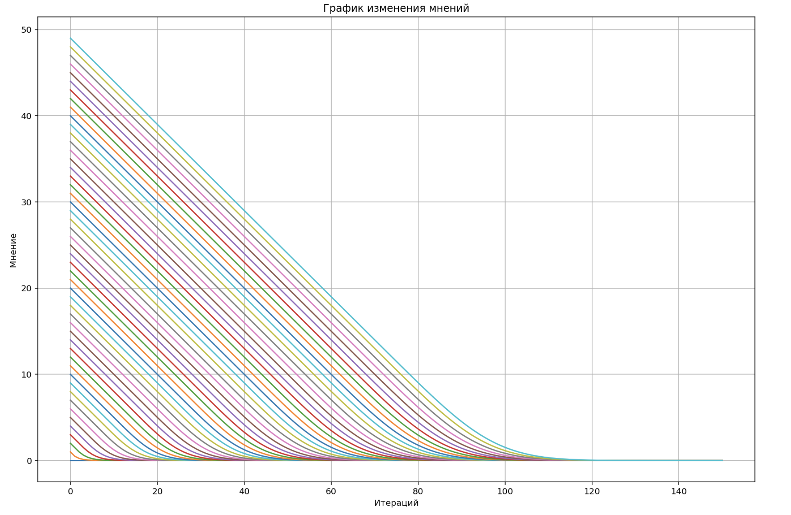
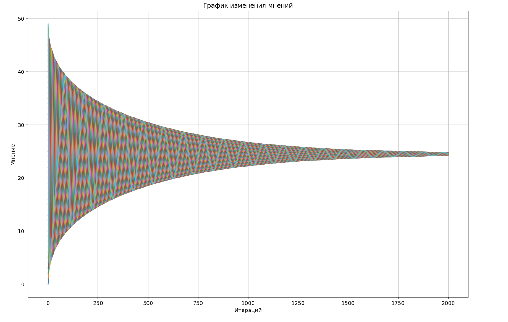

### Проект по моделированию распространения мнений в социальных сетях

В рамках проекта было рассмотренно две этапа распространения мнений в обществе

* Распространение информации в сети среди участников

    Подход основани на адаптации SIR-модели и модели Daley - Kendall для оценки распространения мнений в обществе

* Изменение мнений участников этой сети об информации 
    
    Подход основан на построении матрицы взаимодействий между участниками сети с использованием теории марковских цепей

Кроме того в рамках проекта было придумано множество примеров, демонстрирующих работу модели.

Примеры результатов работы модели по изменению мнений участников сети об информации

 

**Детальное описание проекта и теоретическая справка находится в .ipynb файле**
